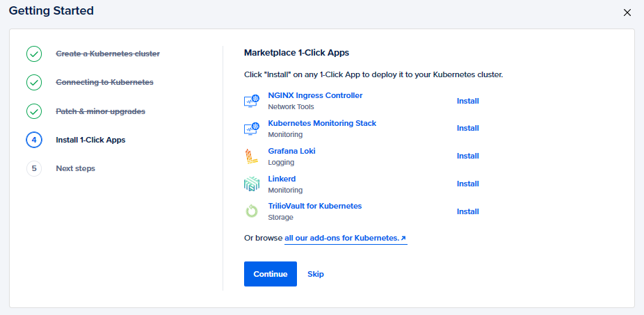

# Getting Started with Kubescape on Digital Ocean


## Introduction

While working with Kubernetes, the security of the clusters is a top priority. Apart from that we also need to figure out the vulnerabilities present, the outdated configurations or deployments, compliances, security standards, and their immediate remediation suggestions.

For all of these concerns, **Kubescape** comes in handy and is a great open-source tool for K8s cluster security that can take care of these for you with just a single scan of your cluster. 

So, today we will be setting up a K8s cluster on Digital Ocean, installing Kubescape on top of it, and running our first cluster scan to find out the detailed security report.

## Deploying a Digital Ocean K8s Cluster

As all of you know, Digital Ocean is a cloud computing service provider that offers compute instances to K8s cluster to DBs and container registries, and much more with high reliability, scalability, and a pay-as-you-go model. So, let's spin up a cluster using DO first.

**Step 1:** Sign in to Digital Ocean or create an account if you don't have an account yet. You can [signup](https://try.digitalocean.com/freetrialoffer/) instantly and they would provide 100$ credits for the trial.


**Step 2:** Tap on `Kubernetes` from the left navigation pane and wait till it opens up the next dashboard. Now hit the `Create a Kubernetes Cluster` to start with the cluster setup.


**Step 3:** In the configuration dashboard, enter the details for the cluster as per your requirement. However, you can find a standard cluster configuration listed below to try this out.

- **Select a Kubernetes Version:** Use the latest recommended one (1.21.9-do.0)
- **Choose a Datacenter Region:** Use the one closest to your location (Asia-BLR in my case)
- **VPC Network:** Leave it at default
- **Choose Cluster Capacity:**    
  - **Node Pool Name:** Set as per your choice or leave it at default    
  - **Machine Type:** Basic Nodes (We don't need Premium instances for a trial)
  - **Node Plan:** $20/month per Node (4GB Total/2 vCPUs)    
  - **Node Count:** 3
- **Finalize:**     
  - **Name:** Leave at default    
  - **Project:** Leave at default    
  - **Tags:** Leave them empty as well

You can now click on `Create Cluster` to get the cluster provisioned for you (usually takes 4 mins).


**Step 4:** Now we need to get connected to our cluster so that we can run a `Kubescape` scan on the cluster. Follow the steps below to get done with your cluster connection.


- **Getting Started** <br/>
Tap on `Get started` and choose a client that you want to use to interact with the cluster. We will also need to set up an authentication certificate to authorize the client to connect to the cluster (Validity 7 days).


- **Connecting to Kubernetes** <br/>
We can either set up an automated way to connect to the cluster (The authentication certificate gets automatically updated) or go with the manual method in which we need to update the certificate every 7 days. We will use the manual method for now for which we need to download the `cluster config` and run the command below.

```javascript
cd ~/.kube && kubectl --kubeconfig="Your Config File Name" get nodes
```

This should return you the list of nodes for your cluster.


> **NOTE:** For the automated mode, you need to install and configure the `doctl`. You can find the installation steps [here](https://docs.digitalocean.com/reference/doctl/how-to/install/).

- **Patch & minor upgrades** <br/>
Here you can specify whether you want to apply minor version upgrades and patches to your clusters or not and which timeframe will be best to do so. For now, you can select `Automatically install minor version patches` and specify a time window when the cluster should upgrade, and then hit `Save and Continue`.


- **Install 1-click Apps** <br/>
This step enables you to choose and install apps in your cluster directly from the marketplace. You may add some apps or skip this step.



- **Next Steps** <br/>
The configuration ends with this step. Go ahead and download the cluster config and store it safely for future use and then click on `Great, I'm done` to complete the process.


## Installing Kubescape

It's time to get started with the `Kubescape` installation now. Follow the steps below so that we are ready to run our first scan.

You can install Kubescape on your machine using the following command.

**For Windows**

```
iwr -useb https://raw.githubusercontent.com/armosec/kubescape/master/install.ps1 | iex
```

**For Mac**

```
 brew tap armosec/kubescape
 ```

 ```
  brew install kubescape
  ```

You can also find the installation steps for other distributions [here](https://github.com/armosec/kubescape#install).

> **NOTE:** Windows Installation requires the use of **Powershell v5.0+**. Also, if you encounter any issue while executing the above command on windows, you may need to change your execution policy. You can do that by the following command.

```
Set-ExecutionPolicy RemoteSigned -scope CurrentUser
```


## Running your first Kubescape Scan

We have now installed the Kubescape tool and are ready to run our first cluster scan. You can do that using the following.

```
kubescape scan
```

This displays all the scan reports and results on the CLI itself where you ran the command. But that can be a little overwhelming, right? So, Kubescape has also a cloud UI where you can visualize all these data in a better way.

> **NOTE:** If the above command errors out saying `No such Host`, then compare the config file in the `.kube` folder with the downloaded cluster config file and make sure they both are the same.

## Kubescape Cloud UI

We can transfer all the scan results to the cloud UI and interpret them in a better way easily. To do that, we need to follow the steps below.

**Step 1:** Create an account at Kubescape Cloud Portal if you don't have one yet. You can simply do that [here](https://portal.armo.cloud/).


**Step 2:** Once you've created your account and signed in, you can see two commands on the page, one which installs Kubescape (which we have already done) and the other with the scan command with an `account token`.


We can use the second command now to run the scan and push the results to our account's cloud UI.

```
kubescape scan --submit --account=YourAccountToken
```


Towards the end of the run, you would find the URL mentioned where you can visualize all this information through the UI. You can also refresh the UI dashboard and the results will start populating with all the details.


Damn! Isn't that cool? Well, with this you have already run your first cluster scan using Kubescape. You can also run scans specific to a framework such as [nsa](https://www.nsa.gov/Press-Room/News-Highlights/Article/Article/2716980/nsa-cisa-release-kubernetes-hardening-guidance/) or [MITRE ATT&CK®](https://www.microsoft.com/security/blog/2021/03/23/secure-containerized-environments-with-updated-threat-matrix-for-kubernetes/) or go ahead and scan any local `yaml` or `json` files to have vulnerable-free deployments.

With this, we have reached the end of the tutorial. I hope all of you got to learn something new and it was really helpful for you. Feel free to give a like or drop in your feedback in the comments.
<br/><br/>

> **NOTE:** All the dashboard images used here are the respective properties of `Digital Ocean` and `Kubescape` and are intended for illustrative purposes only.
