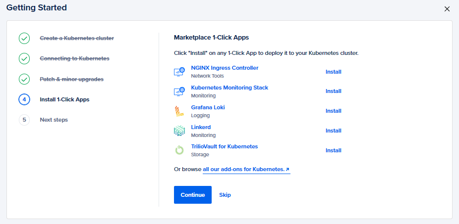
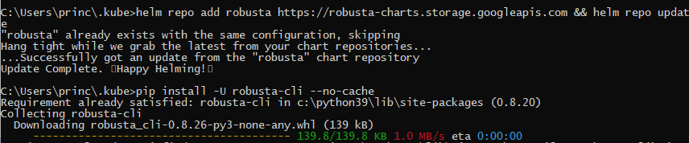

# Getting Started with Robusta on Digital Ocean

## Introduction

Robusta is an open-source platform for Kubernetes troubleshooting and automation. It makes it really easier to figure out pod crashes, send in alerts and describe a detailed analysis report on the breakdown.

Just like Docker is infrastructure-as-code for deploying applications, Robusta is infrastructure-as-code for maintaining K8s applications and handling their alerts.

If you're also wondering how to put this amazing tool into play and see it in complete action, then you have just landed on the right article. Today we will be setting up Robusta on our K8s cluster that is hosted using Digital Ocean.

## Deploying a K8s cluster on Digital Ocean

Digital Ocean is a great cloud computing platform and it offers several cloud resource models with high scalability, availability, and the pay-as-you-go model for various customer use cases. Today we will be creating a Kubernetes cluster on Digital Ocean with the following steps.

**Step 1:** Sign in to Digital Ocean or create an account if you don't have an account yet. You can signup instantly and they provide 100$ credits for trial.


**Step 2:** Once you're logged in, you can find `Kubernetes` listed in the left navigation pane. Click on that and wait till it navigates to the next dashboard.


**Step 3:** In the Kubernetes dashboard, simply click on `Create a Kubernetes Cluster` to start with the configuration process.


**Step 4:** Now you need to fill up the configuration details for your cluster as per requirement. However, for a trial purpose, you can set up with the configuration given below.

- **Select a Kubernetes Version:** Use the latest recommended one (1.21.9-do.0)
- **Choose a Datacenter Region:** Use the one closest to your location (Asia-BLR for me)
- **VPC Network:** Leave it at default
- **Choose Cluster Capacity:**    
  - **Node Pool Name:** Set as per your choice or leave it at default    
  - **Machine Type:** Basic Nodes (We don't need Premium instances for a trial)
  - **Node Plan:** $20/month per Node (4GB Total/2 vCPUs)    
  - **Node Count:** 3
- **Finalize:**     
  - **Name:** Leave at default    
  - **Project:** Leave at default    
  - **Tags:** Leave them empty as well

Now click on `Create Cluster` and wait till it is provisioned (takes usually 4 mins).


**Step 5:** Now it's time to set up a few things for our cluster before we dive into the `Robusta` installation on top of it.


- **Getting Started** <br/>
Click on Get started. On the next screen that appears, we need to choose a client that we want to use to interact with our cluster. Also, we need to set up an authentication certification method to authorize the client to connect to our clusters which lasts for 7 days.


- **Connecting to Kubernetes** <br/>
You can either set up an automated way of doing this or a manual way where you need to download the `cluster config` file every 7 days and run the below command putting the config file in your `.kube` folder in your system. We would proceed with the manual method for now.

```javascript
cd ~/.kube && kubectl --kubeconfig="Name of your config file" get nodes
```

This should return you the list of nodes for your cluster.


> **NOTE:** If you want to set up the automated mode, then you need to install and configure the `doctl` first. You can find the installation steps [here](https://docs.digitalocean.com/reference/doctl/how-to/install/).

- **Patch & minor upgrades** <br/>
You can opt for patches and minor version upgrades in this window. Simply select `Automatically install minor version patches` and specify a time window when the cluster should upgrade. Click on `Save and Continue`.


- **Install 1-click Apps** <br/>
Here you can choose and install apps in your cluster directly from the marketplace. You can skip it for now.



- **Next Steps** <br/>
Now we are done with our configuration. You can simply download the cluster config and store it safely and click on `Great, I'm done` to complete the configuration process.


## Installing Robusta on our Cluster

As our cluster is provisioned and fully configured now, we will now start installing robusta using their `60 seconds Install` procedure.

**Step 1:** We need to install the `Helm` chart and the `Robusta-CLI` first. We can do that by running the following command.

```javascript
helm repo add robusta https://robusta-charts.storage.googleapis.com && helm repo updatepip install -U robusta-cli --no-cache
```



**Step 2:** Now we need to generate a config file for Robusta. While we fetch the config file, we can also enable the Robusta UI and slack/teams integration to receive alerts when something fails.

```javascript
robusta gen-config
```

There will be a number of inputs required from your end to run this command successfully. You can follow the snippet below.


You need to authorize the Slack integration and specify the workspace and the respective channel where you want to integrate and receive the alerts.


Once you have authorized, you will be redirected to the page below and then you can proceed in your terminal with the remaining ones.


Once all the steps are completed successfully, a `generated_values.yaml` file is generated that contains your Robusta account credentials. Store it safely for future use. You should also receive an alert in your workspace channel that robusta has been added there.


**Step 3:** Now we are gonna install Robusta using Helm. The `generated_values.yaml` would act as the `values.yaml` for helm here.

```javascript
helm install robusta robusta/robusta -f ./generated_values.yaml
```

This should install robusta successfully in your cluster.


> **NOTE:** If the above command errors out saying `Unable to connect to the server`, then cross-check the config file in the `.kube` folder and make sure it has the same details as your downloaded cluster config file.

**Step 4:** Now run the command below to verify whether Robusta is deployed or not in the current namespace.

```javascript
kubectl get pods
```


## Testing alerts for a Crashing Pod

Now that we have successfully deployed Robusta, it's time to see it in action. We will now deploy a crashing pod and check whether we get alerts in slack after it fails twice. We will also go to the UI to fetch the other details.

**Step 1:** We will now create a crashing pod.

```javascript
kubectl apply -f https://gist.githubusercontent.com/robusta-lab/283609047306dc1f05cf59806ade30b6/raw
```

**Step 2:** Now run the following to check whether the `crashpod` is deployed and has reached 2 restarts or not that would trigger an alert in Slack.


**Step 3:** Open slack and check in the specified workspace's channel whether you have received an alert or not.


**Step 4:** It's time to move to the UI now. Navigate to `https://platform.robusta.dev/` and log in using the same Gmail that you mentioned while generating the robusta config file.


Once you are logged in, you can see the dashboard with all the pods in all namespaces, and the ones with issues or errors are marked as well.


You can also click on each pod card and dive in for more information on the errors or issues with all the details and timestamps i.e., a complete analysis of the breakdown if any.


Well, we have reached the end of this extensive tutorial. Time to give a pat on your back for following along and successfully utilizing such an amazing tool **`Robusta`**. I hope all of you found this really helpful and it covered almost all minute details that you may come across. Feel free to like this article and drop in any comments or suggestions you may have.
<br/><br/>

> **NOTE:** All the dashboard images used here are the respective properties of `Digital Ocean` and `Robusta`. They are used here only for illustrative purposes.
