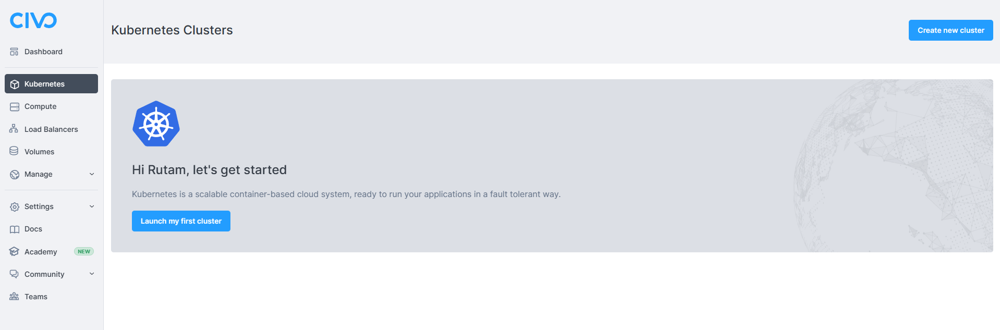

# Getting Started with Robusta on Civo Cloud


## Introduction

Robusta is an open-source framework for your K8s automation and troubleshooting. It not only fires alerts when something goes wrong but also provides an insight as to what could have made this happen and even suggests a one-click fix for most common issues (OOMKill, Crashloop, CPUthrottling) that you come across.

It uses Prometheus for the monitoring part and suggests fixes on top of it. It also enables you to figure out any recent changes that could have impacted your clusters. In short, Robusta is building a database of all errors that you take down your clusters with all possible solutions to fix those.

Sounds interesting, right? Well, let's try to set it up then and see it in action. We will be using a Civo managed K8s cluster and deploying Robusta in it to do the troubleshooting for us.

## Launching your K8s Cluster on Civo

Civo is a first-of-a-kind cloud-native service provider powered only by Kubernetes. It offers blazing-fast cluster launch times (<90 seconds), a simplified developer experience, and transparent pricing. Now let's provision a cluster and set Robusta to do the magic.

**Step 1:** Signup for a Civo account if you don't have one yet. They offer 250$ worth of free credits for a month to try their platform.


**Step 2:** Once you're logged in, you can automatically see the `Launch my first cluster` button if it's your first time accessing the dashboard or a list of your created clusters and a `Create new Cluster` button on the top right corner. Click on any of the buttons to create a cluster.



**Step 3:** On the next page we need to define the configurations for the cluster. You can use the below configuration for now.

- **Cluster Name:** Type a name of your choice 
- **How many instances:** 3 
- **Network:** Default 
- **Firewall:** Choose Default (All ports are open) or Create a new one as you require
- **Select Size:** Standard (Medium- 2CPU Cores/4GB RAM)   
    - **Switch:** Flip the switch to `Hourly` instead of `Monthly` 
- **Show Advanced Option:** Leave it at default selection 
- **Marketplace:** Choose `Helm` app from the `Management` tab

Click on `Create Cluster` and wait for the cluster to be fully provisioned.


**Step 4:** Once the cluster is up and running, we need to set up the `Civo-CLI` to interact with our cluster. Let's start doing this by installing the `Civo CLI` first.

 **For Windows**

You can find the installation guide for installing `Chocolatey` [here](https://chocolatey.org/install).

```
choco install civo-cli 
```

 **For MacOS**

```
brew tap civo/tools brew install civo
```
You can find more installation details for other distributions [here](https://github.com/civo/cli#set-up).


Once the installation is complete, you can check it by running the command `civo` in the terminal which should return a bunch of available commands.

> **NOTE:** Always run the `cmd` or `terminal` in Admin mode to prevent any errors as many packages need elevated permissions while installation.

**Step 5:** Now we need to set up the Civo CLI with our Civo API key associated with our account. If you are logged in to your Civo account, then you can get your API key [here](https://www.civo.com/api#authentication).

```
civo apikey add My_Key YourAPIKeyHere
```

Also, set the key that we just saved above as the Current key.

```
civo apikey current My_Key
```


**Step 6:** In this step we need to download the cluster configuration and save it to the config file in the `.kube` folder. Make sure you have `kubectl` installed already or you can find the installation steps [here](https://kubernetes.io/docs/tasks/tools/).

```
civo kubernetes config YourClusterName --save
```


> **NOTE:** If you have a config file in `.kube` folder already, then Civo CLI merges the new configuration details to the existing file with a new context. You can always access your cluster using `kubectl`, but make sure you have switched your context to the respective one.

```
civo kubernetes config YourClusterName --save --merge
```

```
kubectl config use-context yourconfigname
```

## Installing Robusta on the Cluster

Now that you're done setting up your cluster and accessing it from the Civo CLI, it's time to deploy Robusta in our cluster.

**Step 1:** We need to download the `Helm` chart and then install the `Robusta-CLI` initially. Use the following command to do so.

```
helm repo add robusta https://robusta-charts.storage.googleapis.com && helm repo update
pip install -U robusta-cli --no-cache
```


**Step 2:** In this step, we will generate a configuration file for Robusta. We can also set up integrations for Slack or MS Teams and enable the cloud UI to check all metrics and features in action.

```
robusta gen-config
```

Please make sure to check the snippet below in case you need any help to set up all the things needed to complete this step.


When you hit `Y` for the Slack integration (recommended), it opens a new tab in the browser where you can authorize Robusta to integrate into your workspace.


Select the workspace you want to integrate it to and then click `Allow` when prompted for the permissions.


Now, this completes the authorization process and you can close this tab and continue with the rest of the options to complete this step.


Once the step completes successfully, store the `generated_values.yaml` securely for future use.

> **NOTE:** I had a Robusta account already. So, I had to provide the Robusta account token which is available in `generated_values.yaml` that was created for me when I initially signed up for a Robusta account and generated the Robusta config file. If you don't have an account, you can simply select `N` when asked and then provide a Gmail with which you want to log in to the UI. You can follow the snipped below.


**Step 3:** It's time to install Robusta now using Helm. We will use the `generated_values.yaml` as the `values.yaml` for Helm here.

```
helm install robusta robusta/robusta -f ./generated_values.yaml
```


**Step 4:** Now it's time to check whether Robusta is installed correctly or not in the current namespace using the command below.

```
kubectl get pods
```

## Crashing Pod Alerts

We will now try to see what exactly Robusta does when we deploy a crashing pod in our cluster.

**Step 1:** Deploy a crashing pod using the command below.

```
kubectl apply -f https://gist.githubusercontent.com/robusta-lab/283609047306dc1f05cf59806ade30b6/raw
```

**Step 2:** The crashing pod is configured such that it crashes and restarts. Once it reaches 2 restarts Robusta should fire an alert in Slack informing the same. Let's check whether the pod has restarted twice or not.

```
kubectl get pods -A
```


**Step 3:** Now open the slack workspace in which you have configured to receive the alerts and check the respective channel to see the alert along with logs.


**Step 4:** Now we can open the Robusta UI which is available at `https://platform.robusta.dev/` and use the same email that you used while generating the Robusta config file.


**Step 5:** Once you're logged in to the dashboard, you can find the list of all pods in all namespaces and any issue or anomaly detected is already marked on the respective pod card.


You can also click on each pod card to gather more detailed info, timelines, and the priority of the issues, all gathered in one place for you automatically.


Drumroll! We have finally reached the end and have successfully deployed Robusta on our cluster. Always feel free to drop in your comments or suggestion below and don't forget to drop a like if you found this useful. Also, let me know how useful did you find Robusta.

If you want to learn how to deploy Robusta on Digital Ocean, then you can find the tutorial [here](https://dev.to/heyrutam/getting-started-with-robusta-on-digital-ocean-3g41).<br/><br/>

> **NOTE:** All the dashboard snippets are the sole property of `Civo` and `Robusta` respectively and are used here only for illustrative purposes.
